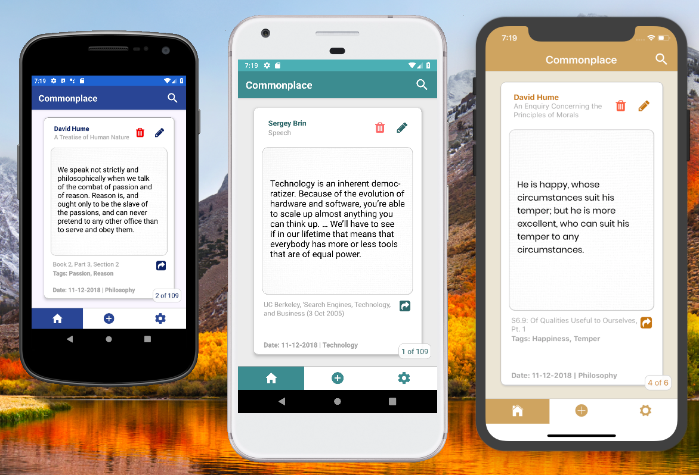
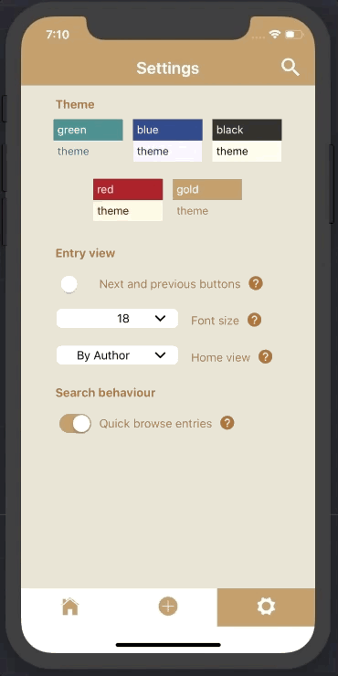
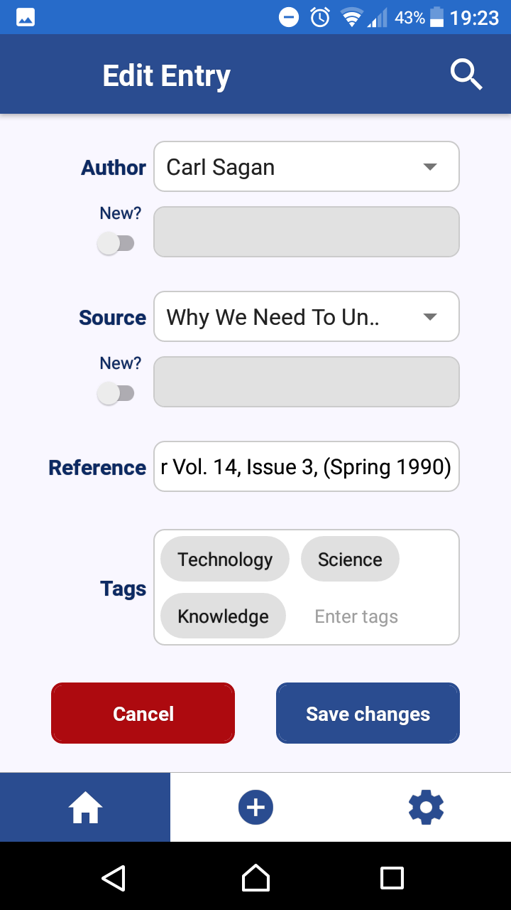

# Commonplace Book

## What?
### A robust, searchable digital repository for the ideas, quotes and maxims that strike you as you go about your life, wherever they come from.

Quickly capture, categorise, and tag passages from books, articles, essays, or your own imagination.

Search your commonplace book by category, tags, author, source, and/or date, to find the perfect entry to inspire an essay, speech, article, or your personal philosophy.

Build a reference of ideas that matter most to you - captured in a way that makes sense to you.

##
## Why?
We consume more information than ever, but so much of it immediately slips through our fingertips and out of our minds.

Capturing and cataloguing ideas that strike you at a moment in time will make it more likely that you can hold on to and refer back to those ideas in the future - whether for your own reflection when facing particular challenges or opportunities, or to weave into your writing and speaking.

The act of reflecting on which ideas are important to you and what they are about helps you to connect ideas and develop your thinking.

Many digital solutions for capturing notes exist (e.g. Evernote, Day One, OneNote), but they lack detailed cataloguing and searching power, tending to be limited to tags and broad text searches.

The Commonplace Book app is tailored specifically to easily capturing and comprehensively searching entries, with a user interface and presentation designed to exactly match its purpose of storing and recalling ideas and who and where they came from.

##
## How?
#### An offline-first mobile application built in React Native ####

- Built in React Native with configuration for iOS and Android deployment, throughout development.
- Local Realm (NoSQL) database for storing entries. 
- Async Storage for storing user settings between sessions.
- Redux store for in-memory state management.
- Tested and tweaked to accommodate a range of screen sizes.
- Navigation by stack, tab, drawer, swipe.

 

##
## Features
#### Fully customisable to allow users to structure and search entries as best suits them. UX enhancements to make entry capture and retrieval intuitive and frictionless.

- Entry capture through Voice-to-Text, Image-to-Text, Photo-to-Text.
- Users can capture entries with date, category, author, source, reference, tags.
- Quick and easy editing of entries.
- Simple content search and quick browse by category/author/tags - or advanced search with multiple filters.
- View and browse entries by swipe or buttons. Share entries with friends.
- Customisations include colour theme, search behaviour, main entry font size, default entries displayed on home page.
- Import and export data to CSV (currently Android with iOS coming soon).

   

## Try it out!
- with XCode **installed**, run `npm run ios` to run on an iOS emulator

*OR*
- with an Android emulator **runninng**, run `npm run android`

*OR*
- follow instructions [here](https://facebook.github.io/react-native/docs/running-on-device) to run on an actual device

#### N.B. app will currently seed the database on each load - you can remove this in App.js, line 17

##
## TODO
- Add import/export db feature to iOS. 
- Image/camera to text on the add/edit form currently relying on Google Cloud Vision API - not suitable for production in the current implementation as the API key shouldn't be bundled with the app. Need (a) a backend to handle requests, or (b) standalone OCR library bundled with the app (big).
- Search form could be improved - when you select e.g. a category, it could adjust the other filter lists to only show other author/sources/tags in that category, progressively narrowing the options. Currently all options are available no matter which are already selected.

